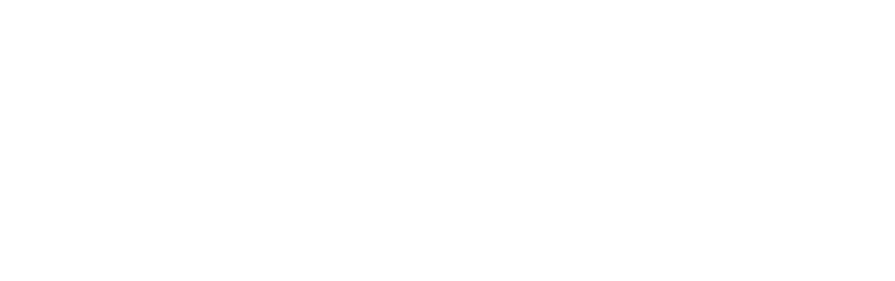

<p align=center>
    
</p>
<h1 align=center><a href="https://aveygo.github.io/NuclearSmoke/">Nuclear Smoke</a></h1>

<h3 align=center><i>Now oxidized with rust! 🦀🦀🦀</i></h3>
<br/>


As a NSW resident, the government really likes to leave us in the dust on bushfire data by preventing the public from accessing critical forecasts and withholding it for commercial use only -> ["Find out how we can support the prosperity and safety of your business in Australia."](http://reg.bom.gov.au/reguser/) which is also under strict licensing agreements 🤗.

The only place we can have any clue about what is on fire at the moment, is from the NSW Rural Fire Service [(RFS)](https://www.rfs.nsw.gov.au/fire-information/fires-near-me), who seem to be the only good guys in this story.

This is where Nuclear Smoke comes it. This is a project attempting to use the very little data provided to estimate smoke fallout in NSW.

I hope for my tool to be use as freely as possibly, as long as it stays free. If this project helped you in any way, you can [donate to the RFS](https://www.rfs.nsw.gov.au/volunteer/support-your-local-brigade), or give the repository a star.

## Important 
Please do not rely on this project for critical information. Call 000 to report a fire emergency or check [Fires Near Me](https://www.rfs.nsw.gov.au/fire-information/fires-near-me) for the most up-to-date alerts. NuclearSmoke only processes existing data and doesn't detect any new fires.  

## How you can help

This project desperately needs real world observations to refine the forecasts. If you can, please take the time to open an [issue](https://github.com/Aveygo/NuclearSmoke/issues/), with the attached forecast & your personal observations. Useful information includes:

1. Time
2. Location / coordinates
3. Visibility (thin, thick)
4. If there are embers in the air

## How it works
TLDR: By assuming that the atmosphere treats nuclear fallout and bushfire smoke the same, we can use the WSEG-10 fallout model to predict expected exposure. For a bit more nuance, see [extra](EXTRA.md).

Overall, there are 4 major steps that this project does:
1. Get information about the fire (size, wind speed, local temperature, etc)
2. Create the WSEG-10 function that predicts fallout for a given location
3. Calculate contours of said function
4. Apply rotation, translation, and earth curvature to the found contours

For this to work, we assume the following is true:
 - Bushfire smoke spreads similarly to nuclear fallout
 - The shape of the smoke contour is smooth and concave 
 - The earth is a perfect sphere and wind has 0 friction

In general, it is a "good-enough" simulation to know if you might be effected by on-coming smoke.  

## Implementation

[NuclearSmoke]("https://aveygo.github.io/NuclearSmoke/") calculates the contours in-browser using wasm and fetches the required data from [OpenMetro](https://open-meteo.com/) and the [RFS](https://www.rfs.nsw.gov.au/). Contours are re-calculated every 15 minutes as that is roughly how often the RFS updated their fires.

For contour detection, I made a custom algorithm that optimizes for speed. See /lib/contours/src/lib.rs for more details. Within the browser, this processes takes less than 1ms / realtime.

The WSEG10 model is translated from [GOFAI](https://gist.github.com/GOFAI/5e22c14d8a2c9644db4add3829e3bbde), and is similarly blazingly fast.


## Self Hosting

For offline use, we provide a small binary file to calculate the bounding boxes of the fallout forecast. 

```
./nuclearsmoke --fire-mt 1.0 --wind-speed 10.0 --wind-shear 0.1 --threshold 100
```
Prints something like ```11.61,5.90```, where the first number is the "downward_distance" (km), and the second is the "spread_from_center" (km) of the bounding box, as illustrated in the below diagram.



Note how wind direction is not utilized as it doesn't effect the size of the bounding box; only the direction. That will need to be accounted for in your calculations whatever they may be. It is also important to add that the exact shape of the contours is not reflected in the bounding box, but it can be very well estimated with a simple ellipsoid in most cases where the wind shear is low.

Wind shear is a bit of a weird measurement, but can be calculated taking the absolute difference between two wind samples at different heights, then dividing by the height difference, eg:
```
measurement 1 = 10km/h @ 10m high
measurement 2 = 15km/h @ 100m high

thus, delta_speed = 5km/h, delta_height = 90m,
finally, wind shear = delta_speed / delta_height => 0.06km/h/m
```

## Issues & Feature Requests

Nuclear smoke is under constant active development, but if you want to see a given feature or report on some real-world observations, you can create a github [issue](https://github.com/Aveygo/NuclearSmoke/issues). Please put as much detail as possible to make the process easier, including photos if possible.

## Development
Pull requests are encouraged if you have some experience you are willing to share.

To build the wasm file, use:
```
wasm-pack build --target web
```

Otherwise, to create the offline binary, use:
```
RUSTUP_TOOLCHAIN=stable cargo build --bin nuclearsmoke --release
``` 

## End

I hope that this project helps out with whatever you're doing! Stay safe and have a good day.
